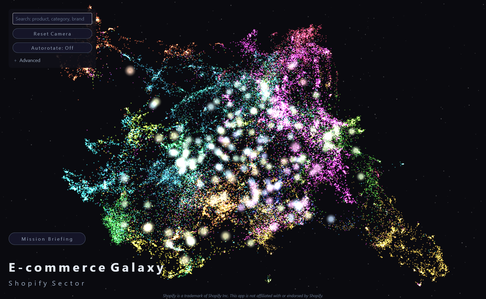
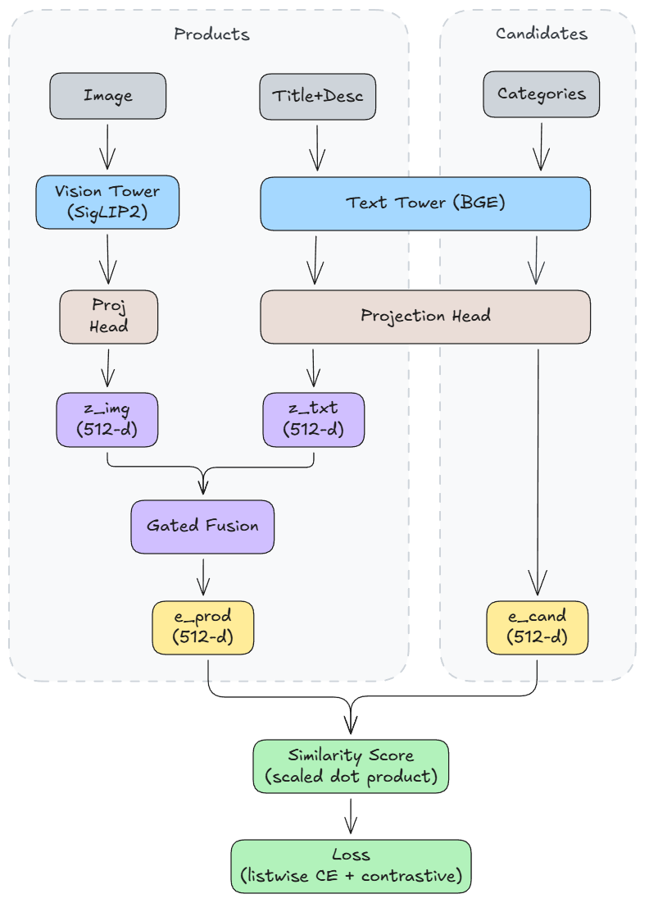

# Product Catalogue Bi-Encoder Reranker

Two-tower multimodal reranker for product categorization using the Shopify [product catalogue dataset](https://huggingface.co/datasets/Shopify/product-catalogue) (Apache 2.0 license).

Powers the data visualization web app at: https://embedding-constellations.jonathanhsiao.com



## Overview

This project implements a two-tower architecture that learns to rank product categories given:
- **Product inputs**: (image, title+description)
- **Candidate categories**: A list of hierarchical category paths

The model produces stable product embeddings that can be used for visualization, clustering, and downstream tasks.

## Architecture

- **Vision Model**: SigLIP2 ViT-B (`google/siglip2-base-patch16-256`)
- **Text Model**: BGE v1.5 base (`BAAI/bge-base-en-v1.5`)
- **Projections**: 2-layer MLP + LayerNorm → 512-dim embeddings
- **Fusion**: Gated fusion with modality dropout
- **Loss**: Listwise softmax + contrastive regularization (multi-positive InfoNCE with cross-batch queue)

### Architecture Diagram



## Training Stages

The model trains in three stages:

1. **Stage 0**: Train projections + fusion only (LoRA applied but frozen)
2. **Stage 1**: Unfreeze text tower LoRA (r=8)
3. **Stage 2**: Unfreeze vision tower LoRA (r=4)

## Outputs

Training produces:
- Checkpoints per stage (`checkpoint_<stage>/`)
- Training logs (`training_log.jsonl`)
- Final metrics (`final_metrics.json`)
- Product embeddings (`embeddings/train_product_emb.*`, `embeddings/test_product_emb.*`)
- Category embeddings (`embeddings/unique_category_emb.*`)

All outputs are saved to `artifacts/runs_product_catalogue/<run_name>/` by default.

## Installation

```bash
pip install -e .
```

For Colab: clone the repo (or upload it), then in a cell run:
```python
# Clone (or upload) the repo first, then from the repo root:
!pip install -e .
```
If you prefer not to install the package, install deps and add the repo to the path:
```python
!pip install -q -U "torch>=2.1" "transformers>=4.53.3" "datasets>=2.18.0" "accelerate>=0.30.0" "peft>=0.11.0" "tqdm" "pillow" "numpy"
# Then in your notebook, from repo root:
import sys
sys.path.insert(0, "src")
```

## Usage

### Training

```bash
python scripts/train.py
```

Or in Colab/Python:
```python
import sys
sys.path.insert(0, "src")  # if running from repo root

from catalogue_biencoder.config import TrainConfig
from catalogue_biencoder.training.runner import run

cfg = TrainConfig()
# Optionally modify cfg here
run(cfg)
```

### Configuration

Modify `TrainConfig` in `src/catalogue_biencoder/config.py` or override values programmatically:

```python
cfg = TrainConfig()
cfg.train_batch_size = 32
cfg.lr = 1e-4
# ... etc
```

### Export Embeddings

```bash
python scripts/export.py <checkpoint_dir> [--output_dir <dir>] [--split train|test]
```


## Dataset

Uses the Shopify [product catalogue dataset](https://huggingface.co/datasets/Shopify/product-catalogue) from HuggingFace:
- Train: ~39K products
- Test: ~10K products
- ~10K unique category paths
